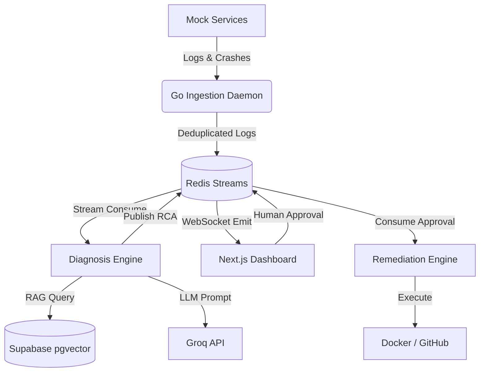

# AgenticMesh 🚀

**AI-accelerated incident triage with human-approved automated remediation.**

AgenticMesh is a next-generation closed-loop monitoring and triage platform. It leverages AI (LangGraph, Groq, and OpenAI Embeddings) to instantly diagnose failures in microservices and provides a seamless real-time interface for engineers to approve or reject automated remediation actions, such as Docker rollbacks, restarts, and GitHub PR creation.

> [!IMPORTANT]  
> **Human-in-the-loop (HITL):** This system does *not* act autonomously. It is designed to accelerate triage and present highly accurate suggestions. However, **every remediation action requires explicit human approval** before execution, ensuring absolute safety and control.

---

## ✨ Features

- **Real-Time Log Deduplication**: High-performance Go ingestion daemon that deduplicates error logs and pushes them to Redis Streams.
- **AI-Powered Root Cause Analysis (RCA)**: Uses RAG (Retrieval-Augmented Generation) with Supabase `pgvector` to find similar historical incidents, and Groq/Llama-3 for lightning-fast diagnosis.
- **Real-Time Engineer Dashboard**: A sleek Next.js UI using WebSockets to stream live logs and incident tickets instantly without page reloads.
- **Automated Remediation**: A Python daemon that listens for human approvals and executes Docker rollback commands and mock GitHub Pull Requests.
- **Mock Mode**: Fully operational without paid API keys (uses simulated AI and RAG results for local testing and demonstration).

---

## 🏗️ Architecture



1. **Mock Services**: Simulates normal microservice traffic and exposes endpoints to inject crashes.
2. **Go Ingestion Daemon**: Buffers, deduplicates, and standardizes logs before pushing them to Redis Streams (flushes every 5 seconds).
3. **Diagnosis Engine**: Uses AST parsing, RAG (Supabase pgvector), and LangGraph + Groq to generate RCA JSON.
4. **Next.js Dashboard**: Real-time WebSocket UI for engineers to review and approve fixes.
5. **Remediation Engine**: Listens for approval and executes Docker rollbacks and mocks GitHub PRs.

---

## 🚀 Getting Started

### Prerequisites
- Docker and Docker Compose
- (Optional) Groq API Key and OpenAI API Key for real LLM testing.

### 1. Environment Setup
Configure your environment variables in the `.env` file. 

By default, the system is configured to run in **Mock Mode**, which means it will simulate the AI responses. If you want to use the real AI capabilities, update the keys:
- `GROQ_API_KEY`: Required for LLM Diagnosis.
- `EMBEDDING_PROVIDER`: Set to `openai` (Requires `EMBEDDING_API_KEY`).
- `SUPABASE_URL`: Leave empty for mock RAG, or provide your Supabase URL.

### 2. Run the Platform
Start the entire microservices stack locally using Docker Compose:

```bash
docker-compose up --build -d
```

### 3. Open the Dashboard
Navigate to [http://localhost:3000](http://localhost:3000) in your web browser. 

> [!TIP]
> Do not refresh the dashboard once opened! The dashboard uses a real-time WebSocket connection. Historical events are not persisted on page reload. Keep the page open to see live events.

### 4. Inject a Crash (Test the flow)
Open a new terminal and inject a simulated crash into the payment service:

**For Mac/Linux (cURL):**
```bash
curl -X POST "http://localhost:8000/inject-crash?service=payment&type=pool"
```

**For Windows (PowerShell):**
```powershell
Invoke-WebRequest -Method POST -Uri "http://localhost:8000/inject-crash?service=payment&type=pool"
```

Wait for 5-10 seconds. You will see the incident automatically pop up on the dashboard. Click on **Approve** to trigger the automated remediation!

---

## 🛠️ Technology Stack

- **Frontend**: Next.js (React), TailwindCSS, Socket.io
- **Backend/Daemons**: Python, Golang
- **AI/LLM**: LangGraph, Groq, OpenAI Embeddings
- **Database/Cache**: PostgreSQL (pgvector), Redis (Pub/Sub & Streams)
- **Infrastructure**: Docker, Docker Compose
